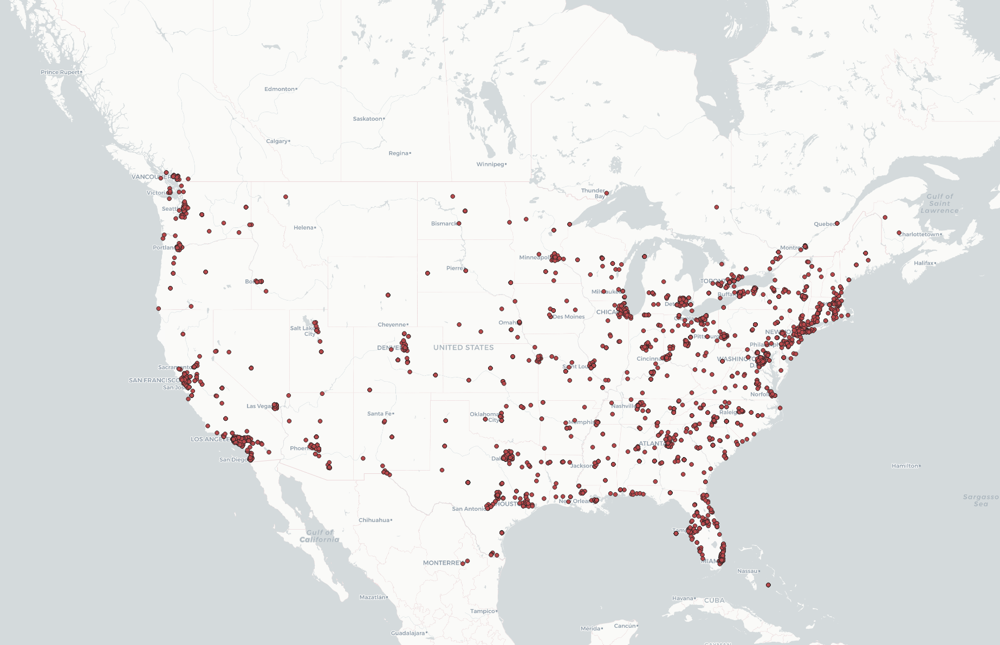
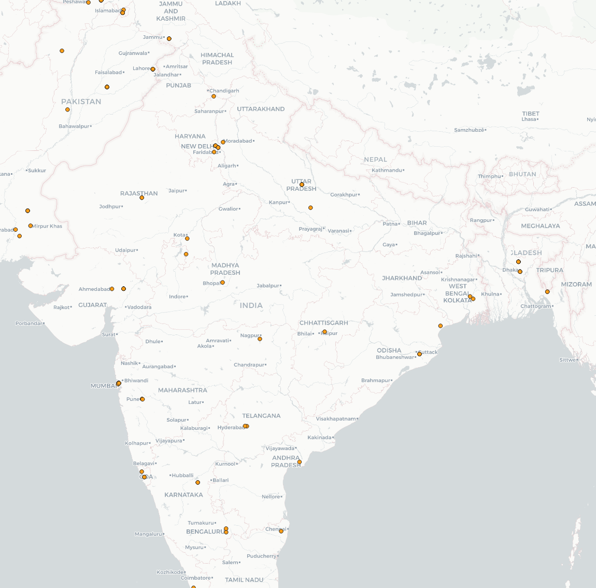

# Introduction
I chose USA and India as the two locations for this lab. Mainly because I am from India and I am currently studying in USA, so I thought these two locations would be relevant to me. The time period is the same for those two

### Maps

For the USA map there seems to be a lot more data points than India's map. I think it has to do with the fact that people in India use Facebook, Instagram and WhatsApp a lot more than Twitter as compared to USA.
 The difference in social media usage between the two countries is very apparent, and this is the geospatial pattern I believe it represents.

### Word Clouds

From the two word clouds, it is very obvious that the most tweeted word is `Job` for USA and `Good` for India. After being in the USA for almost 4 years now, I have heard a lot of people talk about jobs way more than I did in India. While in India, people on social media mostly talk about the entertainment industry. I think this is the cause for the difference in most used words. Also, since there were a lot less data points for India, that might skew those results.